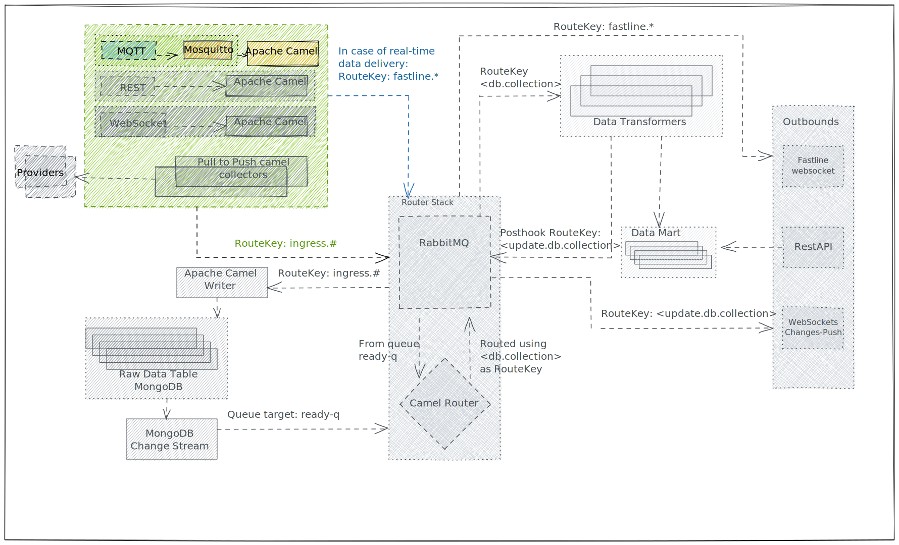

# REST Route



REST Route is the Camel Route responsible for listening to Rest API calls on the perimeter.

## Provider

**REST Route** listens to any POST request on a single port (by default `8080`).

The path a provider uses to make requests is intepreted by the system as [Provider URI](../inbound.md#provider-uri) for the data transported in the request body.

For example making a request:

```sh
 curl -H 'Content-Type: application/json' \
      -d '{ "title":"foo","body":"bar", "id": 1}' \
      -X POST \
      https://localhost:8080/skidata/carezza/paolina?fastline=true
```

the system will associate to the request body the Provider URI

```
skidata/carezza/paolina?fastline=true
```

----

To make REST requests we suggest using [Insomnia](https://insomnia.rest/) or any other REST client.
