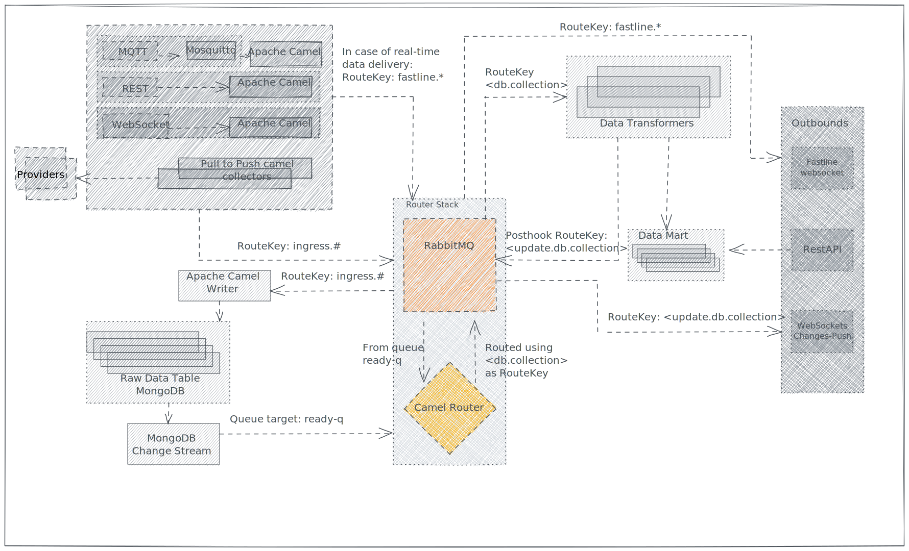

# Router Route

**Router Route** is responsible for building the [Routing Key](../rabbitmq.md#routing-key) of a message after it has been written in the [Raw Data Table](../raw-data-table.md).

For the sake of the PoC, we decided that the routing key is generated the `database` and the `collection` where the data has been inserted.

| Database | Collection | Routing Key |
| - | - | - |
| skidata | ortisei | skidata.ortisei | 
| skidata | skidata | skidata.skidata |

Even if the rule is quite trivial, we decided to create a dedicated route anyway to foresee any future logic which could be more complex.

The generated routing key is then used to inform the correct **Transformer(s)** about the newly inserted data.