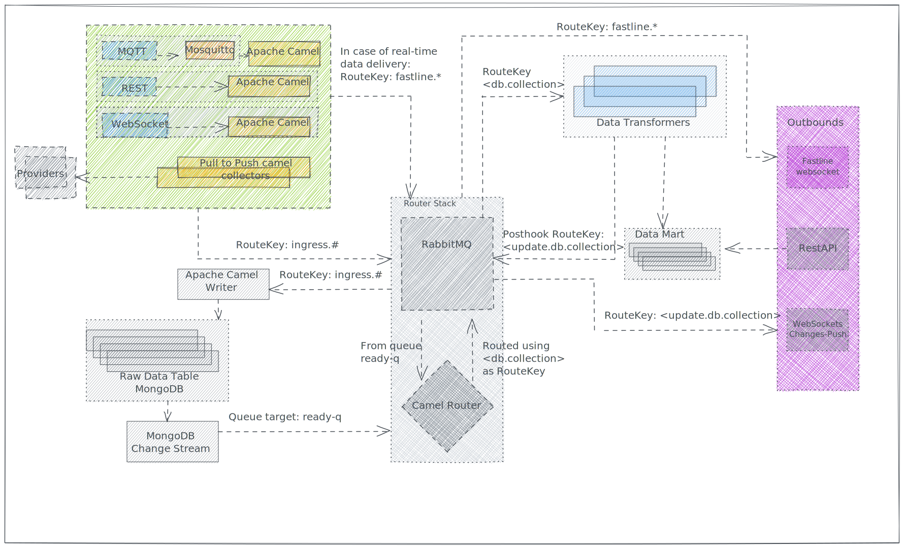

# Fastline Route

**Fastline Route** is an example of the flexibility of the new architecture.

Some provider could request their data is both trasnformed and served using the standard flow, and served as-is in real-time.

By specifying the `fastline=true` **query paramenter** of the [Provider URI](../inbound.md#provider-uri), the inbound APIs will directly transomt the data to a **Websocket** outbound API. Clients can connect to the Websocket and receive real-time as-is data.

In parallel the data will also follow the standard flow, being written in the [Raw Data Table](../raw-data-table.md), routed, transformed and served.

## Example

For the sake of semplicity, we implemented a single websocket which broadcasts all data in sent to a specific RabbitMQ's Queue (`fastline-q`) to any subscribed client using [Camel Jetty Websocket Component](https://camel.apache.org/components/3.20.x/websocket-component.html).

In the future the system will expose multiple websocket, one for each provider, and route the fastline message using a complementary [Router Route](router-route.md).

We suggest [Firecamp](https://chrome.google.com/webstore/detail/firecamp-a-multi-protocol/eajaahbjpnhghjcdaclbkeamlkepinbl) Chrome Extension to subscribe to the websocket and verify that real-time messages are correctly delivered.