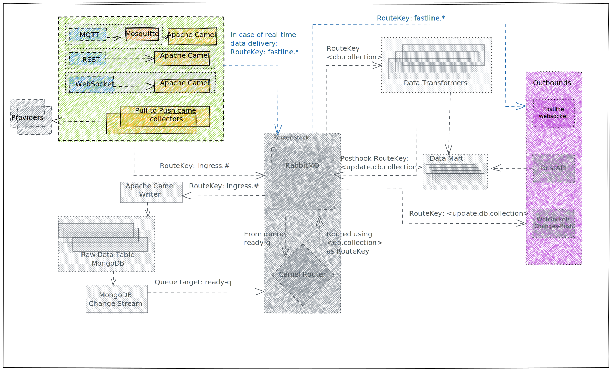

# Fastline Route

| From | To | Note |
| - | - | - |
| RabbitMQ `fastline-q` queue (any of the inbound [RESTRoute](rest-route.md), [MQTTRoute](mqtt-route.md), [PullRoute](pull-route.md)) | Sucscribed clients | If Provider URI requests fastline |



**Fastline Route** is an example of the flexibility of the new architecture.

Some provider could request their data is both transformed and served using the standard flow and served as-is in real-time.

By specifying the `fastline=true` **query parameter** of the [Provider URI](../inbound.md#provider-uri), the inbound APIs will directly transfer the data to a [Camel Jetty WebSocket Component](https://camel.apache.org/components/3.20.x/websocket-component.html) outbound API. Clients can connect to the WebSocket and receive real-time as-is data.

In parallel the data will also follow the standard flow, being written in the [Raw Data Table](../raw-data-table.md), routed, transformed and served.

## Subscription and Routing

**Fastline Route** exposes a single websocket. Clients can subscribe to the websocket and, depending on the path, they will receive real-time data from the Inbound API.

The path the data is pushed to depends on the [Provider URI's path](../inbound.md#provider-uri) used to ingest the data to build the **websocket's path** where to stream the data.

The data will also be streamed to the root path `/fastline`, which is an aggregated endpoint to listen to any provider.

```
websocket path = "/fastline/" + provider uri's path
```

## Example

We suggest [Firecamp](https://chrome.google.com/webstore/detail/firecamp-a-multi-protocol/eajaahbjpnhghjcdaclbkeamlkepinbl) Chrome Extension to subscribe to the WebSocket and verify that real-time messages are correctly delivered.

| Inbound API's Provider URI | Fastline Path | Streamed to |
| - | - | - |
| skidata?fastline=true | /fastline/skidata | ws://localhost8081/fastline and ws://localhost8081/fastline/skidata |
| skidata/carezza?fastline=true | /fastline/skidata/carezza | ws://localhost8081/fastline and ws://localhost8081/fastline/skidata/carezza |
| skidata/carezza/paolina?fastline=true | /fastline/skidata/carezza/paolina | ws://localhost8081/fastline and ws://localhost8081/fastline/skidata/carezza/paolina |
