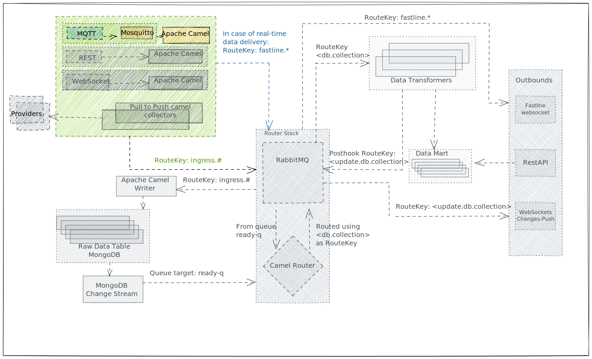

<!--
SPDX-FileCopyrightText: NOI Techpark <digital@noi.bz.it>

SPDX-License-Identifier: CC0-1.0
-->

# MQTT Route

| From | To | Note |
| - | - | - |
| External provider | RabbitMQ `ingress` exchange ([WriterRoute](writer-route.md)) | If valid payload |
| - | RabbitMQ `ingress-dl` exchange | if invalid payload |
| - | RabbitMQ `fastline` exchange ([FastlineRoute](fastline-route.md)) | If Provider URI requests fastline |

MQTT Route is the Camel Route responsible for reading from the `Gateway Mosquitto` ingesting the data in the architecture.

Providers will publish to `Gateway Mosquitto`'s topics where **MQTT Route** is subscribed as a consumer.

## Topic

When subscribing to Mosquitto, the provider has to specify a **topic**. MQTT Route listens to all topics, and topics are automatically created when a publish occurs.

*To publish to Mosquitto we suggest using [MQTTX](https://mqttx.app/).*

The topic where the provider pushes data is used as [Provider URI](../inbound.md#provider-uri) for the data ingested.

-----

## Very important notes

## MQTT Persistence

To achieve a persistent connection, which is a connection where **Mosquitto** keeps the message until a consumer subscribes (in our case the **MQTT Route**), there are some guidelines Publishers, Consumers and Mosquitto have to follow:

To achieve this behavior the publisher needs to properly publish messages and **MQTT Route** needs to establish a **Persistent Connection** with **Mosquitto**:

- Publishers MUST publish with `QoS` == 2
- **MQTT Route** MUST connect with `QoS` == 2
- **MQTT Route** MUST connect with `cleanStart` = false
- ALL **MQTT Route**s in ALL pods must connect with a unique `clientId` which can't change at pod restart

To ensure sessions and messages are persisted even if the `Mosquitto` restarts or goes offline, we have to properly configure the nodes.

in the `.conf` file provided to the mosquitto instance

`persistence true` has to be present.

other fields are available on the [man page](https://mosquitto.org/man/mosquitto-conf-5.html).

In the cloud, the mosquitto deployment has to be managed as `stateful set` to claim a volume where to write the database needed by mosquitto to create a persistent instance.

More about `persistent connections` [here](https://www.hivemq.com/blog/mqtt-essentials-part-7-persistent-session-queuing-messages/) and [here](https://stackoverflow.com/questions/52439954/get-all-messages-after-the-client-has-re-connected-to-the-mqtt-broker)

## Autoscaling
When **MQTT Route** runs in an environment where autoscaling is enabled (EG: Cloud environment orchestrated with Kubernetes) each replica **MQTT Route** ***has*** to generate a `ClientID`.
This configuration property is particularly important when autoscaling is enabled.

`MQTT Client instance 1` => ClientID = 1

When autoscaling is performed

`MQTT Client instance 1` => ClientID = 1

`MQTT Client instance 2` => ClientID = 2

If `MQTT Client instance 2` restarts, the **ClientID** must remain `2`.

***If two clients have the same ClientID, one will crash since the broker won't accept the connection. 
if no ClientID is provided all messages received by the broker while no client is connected will be lost.***
