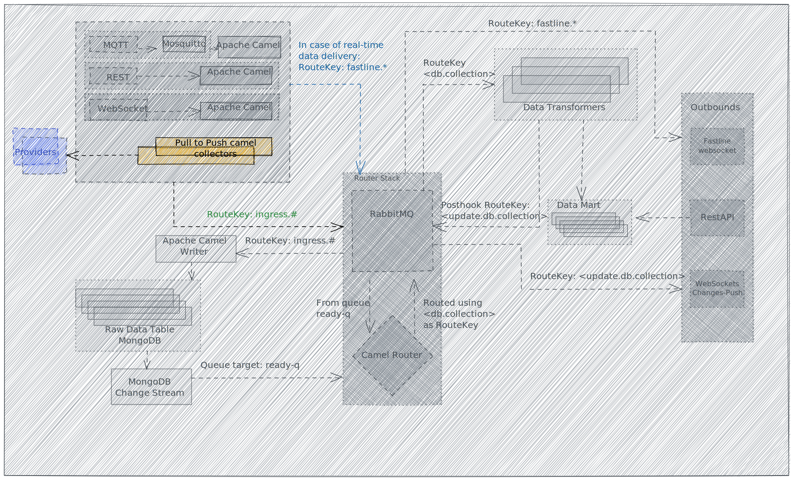

# Pull Route



The **Pull Route** is defined as a set of routes.

Some **providers** do not offer a push mechanism to inform the system about new data or changes in their remote databases. Therefore Open Data Hub has to **pull** or **collect** information actively from them.

**Pull Routes** have the task to pull data from providers and **push** the data to Open Data Hub's system.

Providers could adopt different protocols (API, Websockets) and formats (JSON; XML), and could be protected by different authentication methods (none, basic, OAuth2).

Therefore we need to write some **templates** which support the majority of the combination and *instantiate* one route for each provider.

## Example

For the sake of the PoC, we developed a simple **Pull Route** which ticks using a [Camel Cron Component](https://camel.apache.org/components/3.20.x/cron-component.html) which triggers 1 or more API calls to the configured endpoint(s), it then uses [Wrapper Processor](./wrapper-processor.md) to encapsulate the raw data and sends the result to [RabbitMQ](../rabbitmq.md).

If we replace the **Cron** with a **Rest component** listening to a specified path, we allow a provider to call our rest endpoint with the ID of a changed resource, and the route can perform actively an API call to retrieve the full data.

Provider calls:

```
/skidata/badia/123
```

The route can use `123` to call the remote endpoint

```
https://examplesite.com/badia/data?id=123
```

to get and ingest the desired data.