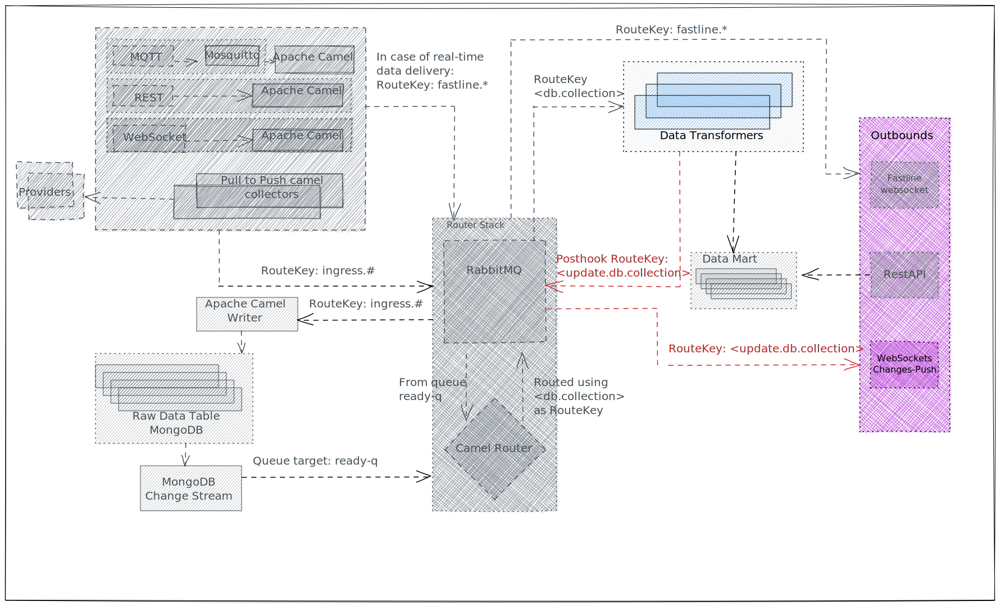

# Push Update Route

| From | To | Note |
| - | - | - |
| RabbitMQ `push-update-q` queue (any [transformer](transformer.md)) | Subscribed clients | If transformer's logic pushes updates |



**Push Update Route** is a mechanism to inform Outbound clients that some data have been updated and inserted in Open Data Hub's Data Marts.

[Transformers](transformer.md) have the ability to publish a [post hook message](transformer.md#post-hook) to RabbitMQ containing useful information about the result of the transformation (could be the id of the entity created/updated).

The message will be then delivered through a [Camel Jetty WebSocket Component](https://camel.apache.org/components/3.20.x/websocket-component.html) outbound API to all subscribed clients.

## Subscription and Routing

**Push Update Route** exposes a single websocket. Clients can subscribe to the websocket and, depending on the path, they will receive push updates from the tranformers.

The path the data is pushed to depends on the [Routing Key](../rabbitmq.md#routing-key) of the message forwarded by the Transformer. 

The data will also be streamed to the root path `/update`, which is an aggregated endpoint to listen to any provider.

```
websocket path = "/update/" + string.replaceAll(routing key, ".", "/")
```

We suggest [Firecamp](https://chrome.google.com/webstore/detail/firecamp-a-multi-protocol/eajaahbjpnhghjcdaclbkeamlkepinbl) Chrome Extension to subscribe to the WebSocket and verify that push-update messages are correctly delivered.

| Transformer Routing Key | Update Path | Streamed to |
| - | - | - |
| skidata | /update/skidata | ws://localhost8082/update and ws://localhost8081/update/skidata |
| skidata.carezza | /update/skidata/carezza | ws://localhost8081/update and ws://localhost8081/update/skidata/carezza |
| skidata.carezza.paolina | /update/skidata/carezza/paolina | ws://localhost8081/update and ws://localhost8081/update/skidata/carezza/paolina |