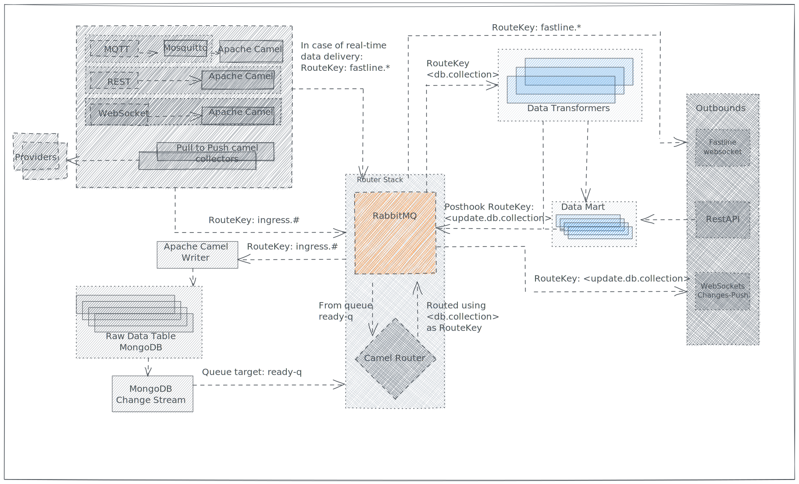

# Transfomers

**Trasnformers** are applications which transform raw data stored in the [Raw Data Table](../raw-data-table.md) and insert the result in [Data Marts](../data-marts.md).

Transfomer's implementation is completely domain dependent and it follows custom logic for each data type ingeste in the system.

There are some behaviours all **transformers** must be complain:

## RabbitMQ Connector

Each **transfomer** must connect to a [RabbitMQ Queue](../rabbitmq.md#queue) and wait for new message.

To connect to RabbitMQ just use a client implementation in the transformer target language.

## MongoDB Connector

The messages polled from RabbitMQ **do not contain** the data, but only a document reference in the [Raw Data Table](../raw-data-table.md).

The **transfomer** has therefore the responsibility yo retrieve the document from the Raw Data Table using a MongoDB client implementation in the transformer target language.

## Poller

The **Transfomer** must poll messages from RabbitMQ and [acknowledge](../rabbitmq.md#ack) or [NACK](../rabbitmq.md#nack) them depending on the transformation outcome.

In some case the transformer needs more messages to build a complete dataset (Flightdata needs 4 different partial data to build a complete state of a flying aircraft), in this case the the **poller** class of the **transformer** should keep in memory the data for a fixed period of time, hoping to get all pieces of information necessary to perform a transformation.

If a configured `deadline` is met, the **transformer** should **NACK** all message before RabbitMQ flags the transformer as `not responsive` and disconnects it.

## Consumer

The consumer is just a function, class or flow inside the **transformer** which takes one or more message and produces a map of "processed messages". All succesfully processed message must be `acked` (to delete them from the system, since they have been successfully processed) and all messages which can be later retried must be `nacked` .

message whoch have **permantly failed the transformation** (for any reason) should be `acked` and logged. If we don't ack them, the system will keep trying to process them, clogging the transformer.

## Post Hook

In some case the transformer wants to inform the system that it has finished transforming some data which is now available in a **Data Mart**.

To do so all **transfomers** must provide a mechanism to send back to RabbitMQ one or more message for each succesfully message before its `ack`.

The **post hook message** can be the route to an outbound api, or it could be captured from another transformer to perform further computation.
