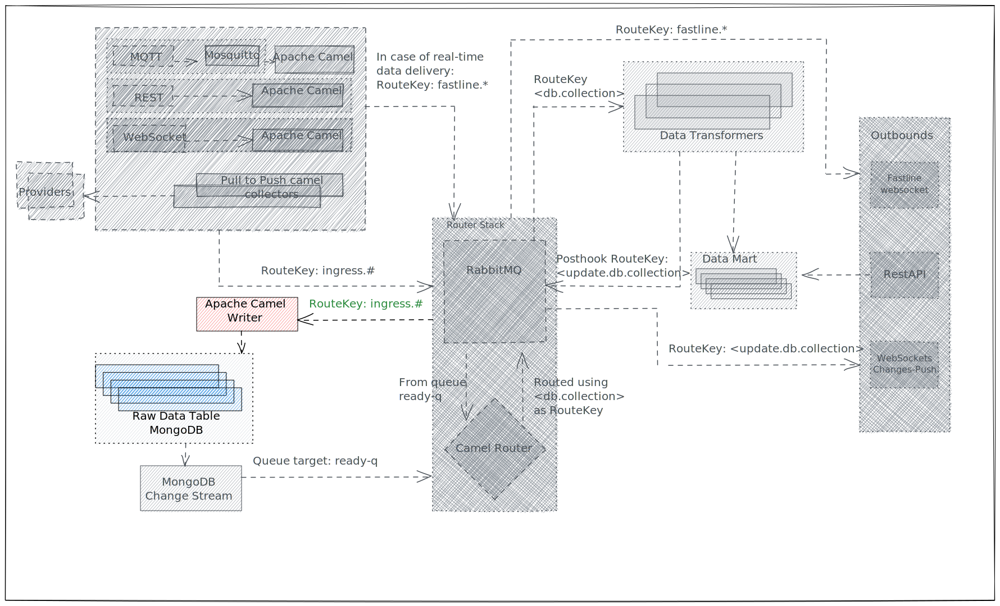

# Writer Route

| From | To | Note |
| - | - | - |
| RabbitMQ `ingress-q` queue (any of the inbound [RESTRoute](rest-route.md), [MQTTRoute](mqtt-route.md), [PullRoute](pull-route.md)) | [Raw Data Table](../raw-data-table.md) |  |

**Writer Route** has the task to pull messages from [RabbitMQ](../rabbitmq.md), more precisely from the **queue** bounded to the `ingress` exchange using `ingress.#` as [Routing Key](../rabbitmq.md#routing-key), and write them in the [Raw Data Table](../raw-data-table.md).

To do so it uses [Camel RabbitMQ Component](https://camel.apache.org/components/3.20.x/spring-rabbitmq-component.html) to read, and [Camel MongoDB Component](https://camel.apache.org/components/3.20.x/mongodb-component.html) to write.

## Database and Collection

One key feature of **Writer Route** is to choose the right `database` and `collection` where to store the data, given a [Provider URI](../inbound.md#provider-uri).

To do that, it uses the **first** segment of Provider URIs **path** as `database`, and the second as `collection` if present.

If the Provider URI has only one segment in the **path**, it will be used for the `collection` as well.

| Provider URI | Database | Collection |
| - | - | - |
| skidata/ortisei/easy?fastline=true | skidata | ortisei |
| skidata/ortisei | skidata | ortisei |
| skidata?fastline=true | skidata | skidata |