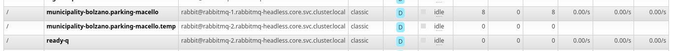

# Replaying already elaborated raw data

**__IMPORTANT:__** First, once again make sure you have your kubectl context pointing to the right environment (dev vs prod):
`kubectl config current-context`

## Pausing current transformer
If your transformer is not idempotent (such as when using bdp mobility) you need to temporarily stop elaboration of new messages.  
Ignore this if you have idempotency

The easiest way is to reconfigure your transformer deployment manually
`kubectl edit -n collector deployments/<your-transformer-name>`

Change the env variables so that the transformer listents to a new temporary queue, using a nonexistant routing key:
```yaml
  - name: MQ_LISTEN_EXCHANGE
    value: routed
  - name: MQ_LISTEN_KEY
  # added postfix .temp
    value: municipality-bolzano.parking-macello.temp
  - name: MQ_LISTEN_QUEUE
  # add postfix .temp
    value: municipality-bolzano.parking-macello.temp
```

Your should now see messages piling up in the old queue, and a new empty queue you created:


After changing to the new queue, delete the data you want to re-elaborate, if necessary

## Deleting time series data
When deleting time series data, make sure to also update the measurement to the most recent, as the BDP API rejects anything that's older than the the most recent measurement. An example of how to do this:
```sql
start transaction;
delete from measurementhistory h
using station s, type t
where s.id = h.station_id 
and t.id = h.type_id
and s.origin='route220' 
and t.cname = 'number-available'
and h.timestamp > to_date('20240510', 'YYYYMMDD');

update measurement m
  set double_value = t.double_value, timestamp = t.timestamp 
from (
select distinct on (h.station_id, h.type_id, h.period) h.station_id, h.type_id, h.period, h.double_value, h.timestamp
from measurementhistory h, station s, type t
where s.id = h.station_id 
and t.id = h.type_id
and s.origin='route220' 
and t.cname = 'number-available'
and h.timestamp > to_date('20240110', 'YYYYMMDD')
order by h.station_id, h.type_id, h.period, h.timestamp desc
) t
where m.station_id = t.station_id and m.type_id = t.type_id and m.period = t.period;

commit;
```

## Regenerating the notifications
Use the `/devops/encore` tool to recreate the rabbitmq messages.  

Edit the `run.sh` file , which also contains the configuration

The most important things are setting the target queue, and to supply a custom mongodb query of the data you want to replay:
```yaml
...
# Mongodb db and collection that is queried
export DB="sta"
export COLLECTION="parking-marlengo"

# Queue the messages are pushed into
export QUEUE="sta.parking-marlengo"

# A mongodb query that is applied to the collection
# Following the "relaxed" format of mongodb extended json: https://www.mongodb.com/docs/manual/reference/mongodb-extended-json/
# e.g. Dates have to be full ISO not just partial
export QUERY='{ "bsontimestamp": { "$gte": { "$date": "2024-06-14T12:22:44.814+00:00"}}}'
...
```

Once you have it configured, just run the `run.sh` file, the tool will report how many records have been generated to which queue

## Clean up
If your transformer is non-idempotent and you are using a temporary queue:
- wait until it has elaborated all the messages
- switch it back to it's original queue
- then delete the temp queue (e.g. via gui)

## Additional tooling
If you need to do some more advanced hackery with queues, the `/devops/detour` folder has some command line examples

